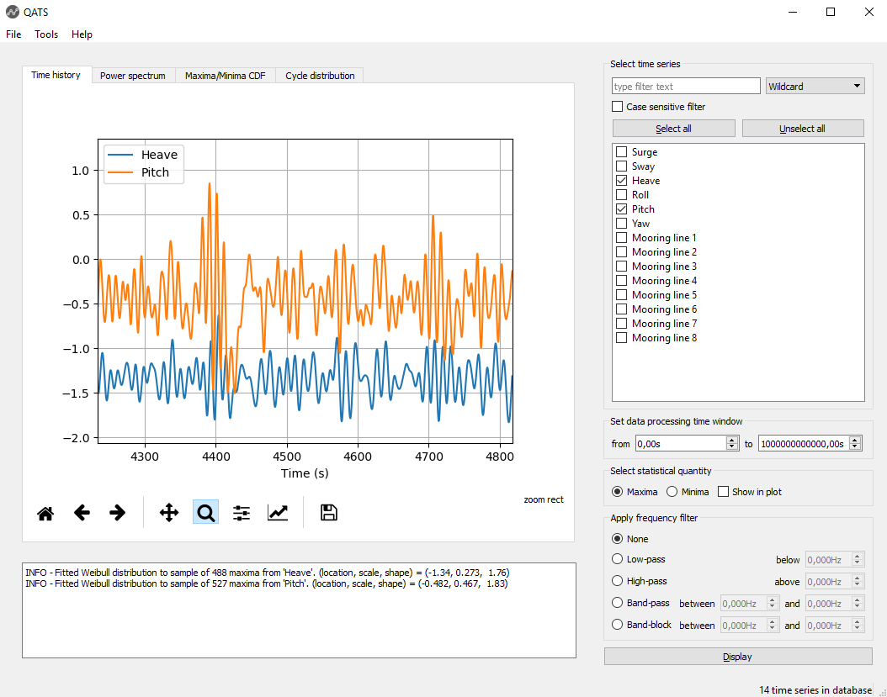

# QATS

Python library and GUI for efficient processing and visualization of time series.

<!-- badges -->

## General

### About

The python library provides tools for:
- Import and export from/to various pre-defined time series file formats
- Signal processing
- Inferring statistical distributions
- Cycle counting using the Rainflow algorithm

It was originally created to handle time series files exported from [SIMO](https://www.dnvgl.com/services/complex-multibody-calculations-simo-2311) 
and [RIFLEX](https://www.dnvgl.com/services/riser-analysis-software-for-marine-riser-systems-riflex-2312). Now it also
handles [SIMA](https://www.dnvgl.com/services/marine-operations-and-mooring-analysis-software-sima-2324) hdf5 (.h5) files, 
Matlab (version < 7.3) .mat files, CSV files and more.  

QATS also features a GUI which offers efficient and low threshold processing and vizualisation of time series. It is
perfect for inspecting, comparing and reporting:
- time series
- power spectral density distributions
- peak and extreme distributions
- cycle distributions

<!-- create a gif that demonstrate the GUI -->


### Resources

* [**Source**](https://github.com/dnvgl/qats)
* [**Issues**](https://github.com/dnvgl/qats/issues)
* [**Documentation**](https://qats.readthedocs.io)
* [**Download**](https://pypi.org/project/qats/)

## Getting started

These instructions will get you a copy of the project up and running on your local machine for development and testing 
purposes. See deployment for notes on how to deploy the project on a live system.

### Prerequisites

Install Python version 3.6 or later from either https://www.python.org or https://www.anaconda.com.

### Clone the source code repository

At the desired location run ```git clone https://github.com/dnvgl/qats.git```

### Installing

To get the development environment running

.. create an isolated Python environment and activate it,

```console
python -m venv /path/to/new/virtual/environment

/path/to/new/virtual/environment/Scripts/activate
```

.. install the dev dependencies in [requirements.txt](requirements.txt)

```console
pip install -r requirements.txt
```

.. and install the package in development mode.

```console
python setup.py develop
```

Now you should be able to import the package in the Python console

```python
import qats
help(qats)
```

.. and the command line interface (CLI).

```console
qats -h
```

## Running the tests

The automated tests are run using [Tox](https://tox.readthedocs.io/en/latest/).

```console
tox
```

The test automation is configured in the file `tox.ini`.

## Building the package

Build tarball and wheel distributions by 

```console
python setup.py sdist bdist_wheel
```

## Building the documentation

The html documentation is build using [Sphinx](http://www.sphinx-doc.org/en/master)

```console
sphinx-build -b html docs\source docs\_build
```

## Deployment
```
TODO
```

## Versioning

We use [setuptools_scm](https://github.com/pypa/setuptools_scm/#setup-py-usage) for versioning. For the versions 
available, see the [tags on this repository](https://github.com/dnvgl/qats/tags). 

## Authors

* **Per Voie** - [tovoop](https://github.com/tovop)
* **Erling Lone** - [eneelo](https://github.com/eneelo)

## License

This project is licensed under the MIT License - see the [LICENSE](LICENSE) file for details.
