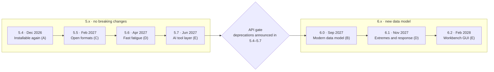

# QATS Roadmap

Agreed between the maintainers, October 2026. Decisions behind this plan are recorded in [docs/decisions](decisions/).

QATS becomes the open workbench for engineers who analyse marine and offshore wind simulation output, through seven focused releases from December 2026 to early 2028 at about 15 hours a month.

## Vision

Any simulation or model-test output goes in, and trustworthy extremes and fatigue come out fast, in a script or in the GUI. Engineers who script want correct methods, control and speed, while engineers who prefer the GUI want guided workflows that give the same results without writing code.

Four principles set the order of the releases:

1. **Remove adoption blockers first.** Today QATS won't install on Python 3.13 or 3.14, and no feature helps someone who can't install it.
2. **Read every format our users have.** New users arrive with OpenFAST, OrcaFlex or Parquet files, so a reader plugin system pays off right away.
3. **Win on engineering depth.** Fast rainflow counting, spectral fatigue and serious extreme-value tools are what general-purpose libraries lack.
4. **Break the API once.** The data-model changes go into a single 6.0 release, with deprecation warnings throughout 5.x.

Each release has one theme and is sized to about 30–40 hours of work. That is roughly 2–3 months at the current pace.

## Timeline

The 5.x releases are additive, so users can upgrade freely. 6.0 is the only planned break, and its deprecations ship as warnings in the four releases before it.

## Releases

The releases are listed in priority order. Letters A–E group the ideas: A adoption, B data model, C formats, D analysis, E GUI and interaction.

| Release | Target | Theme | Scope | Closes | Done when |
| --- | --- | --- | --- | --- | --- |
| 5.4 | Dec 2026 | Installable again (A) | Python 3.11–3.14 following the official support policy, drop 3.8–3.10 ([0004](decisions/0004-python-version-support-policy.md)); PEP 621 metadata + uv by finishing PR #135 (closes #133); ruff replaces black/flake8/isort; CI tests PySide6 only, PyQt6 stays best effort via qtpy ([0001](decisions/0001-pyside6-tested-pyqt6-best-effort.md)); fix flat-series GUI error and multi-drive loading | #134, #130, #136 | `pip install qats` works and CI passes on 3.11–3.14 on Windows, Linux and macOS |
| 5.5 | Feb 2027 | Open formats (C) | Reader registry with entry points replaces the if/elif chain in `TsDB._read`; OpenFAST `.out`/`.outb`, OrcaFlex and Parquet readers; a Bladed reader follows as a plugin before 6.0; lazy reading of large SIMA `.h5` | #90 | A reader can be added from a separate package without touching QATS; a 5 GB `.h5` opens without loading everything into memory |
| 5.6 | Apr 2027 | Fast fatigue (D) | Vectorised reversals + Numba-compiled rainflow as optional extra `qats[fast]` with pure-Python fallback ([0002](decisions/0002-numba-before-rust.md)); from-to counting; spectral fatigue from a PSD (narrow-band, Dirlik, Benasciutti–Tovo); built-in DNV-RP-C203 S-N curves as `SNCurve` presets ([0003](decisions/0003-include-c203-sn-curves.md)); benchmark suite in CI | – | Rainflow is at least 10× faster on a 3-hour, 10 Hz series with identical results; spectral damage is validated against published cases |
| 5.7 | Jun 2027 | AI tool layer (E) | MCP server as optional extra `qats[mcp]` exposing loading, statistics, extremes and fatigue as tools for AI assistants; every answer lists files and settings used; a recorded demo on real SIMA results | – | An assistant answers "give me the 3-hour MPM tension per line" from SIMA files with the same numbers as the equivalent QATS script |
| 6.0 | Sep 2027 | Modern data model (B) | `TimeSeries.meta` and units; pandas/xarray round-trips + `df.qats` accessor; datetime64 time; one HDF5/Parquet export layout that keeps hierarchy and metadata. Deprecations announced in 5.4–5.7 | #5, #10, #13, #84, #110, #111 | A database can be exported and re-imported with no loss of names, structure, units or metadata |
| 6.1 | Nov 2027 | Extremes and response (D) | GEV, peaks-over-threshold with GPD, bootstrap confidence intervals; extremes combined over seeds with convergence checks; decay analysis; transfer functions and coherence (already in `signal.tfe` and `signal.coherence`) exposed as `TimeSeries` methods and in the GUI | – | A worked example reproduces a textbook MPM and its confidence interval |
| 6.2 | Feb 2028 | Workbench GUI (E) | pyqtgraph plots for large series; guided step-by-step workflows for common analyses (extremes, fatigue) without coding; saved sessions; "export analysis as Python script"; standalone Windows installer | – | A 10-million-point series pans smoothly, and a GUI session can be replayed as a script |

### 5.5: OpenFAST, OrcaFlex and Bladed readers

Today users of these tools must export to CSV or another format before QATS can read their results. That step is manual, loses units and doesn't scale to hundreds of load cases. 5.5 reads the native result files directly, through the new reader registry.

| | OpenFAST | OrcaFlex | Bladed |
| --- | --- | --- | --- |
| What it is | NREL's open-source wind turbine simulator, the standard in offshore wind research | Orcina's commercial tool for moorings, risers and marine operations | DNV's commercial wind turbine design tool, used for certification loads |
| Result files | `.out` (text table) and `.outb` (binary), one file per simulation, channel names and units in the header | `.sim` (proprietary binary) holding the whole simulated model | A pair per output group: `.%nn` text header (variables, units, dimensions) and `.$nn` data file |
| How QATS reads it | A small parser in QATS; the format is documented and simple | Only through Orcina's `OrcFxAPI` Python package, which needs an OrcaFlex installation and licence (Windows) | A parser in QATS, similar to the existing SIMO/RIFLEX key + binary readers |
| Main challenge | Several binary variants (compressed integer and float encodings) | Results aren't a fixed list of series: they are computed on request per object, variable and arc length | Groups are multi-dimensional (variable × blade station × time) and must be flattened into named series |
| Testing | Public sample files from the OpenFAST regression tests | No licence in public CI: tests run locally or with recorded fixtures | Needs small sample files that DNV allows us to publish |
| Packaging | Built in | Optional plugin (for example `qats-orcaflex`) so QATS never depends on a licence | Plugin before 6.0, can move into core later |

What users gain:

- **No export step.** Point QATS at a folder of simulations and analyse them directly, in scripts or by dropping files into the GUI.
- **Units kept.** OpenFAST and Bladed store units, which fill the existing `TimeSeries.unit` field now and the 6.0 metadata later.
- **One tool across codes.** Compare OrcaFlex, SIMA and OpenFAST results in the same plot and statistics table, for example for code-to-code verification.
- **Wider reach.** OpenFAST opens QATS to the offshore wind research community; Bladed and OrcaFlex bring in industry users.

Open points: confirm the Bladed format details and permission to publish sample files with DNV. The OrcaFlex reader needs an extra input: which objects, variables and arc lengths to extract, with sensible defaults such as effective tension at both ends of every line.

### 6.0: lossless HDF5 and Parquet export

Today an export followed by a re-import doesn't give back the same database:

- Hierarchy is flattened: `run1/mooring/line3/tension` becomes a basename or `run1_mooring_line3_tension`.
- The `.h5` writer hard-codes the units (`xunit="s"`, `yunit=""`).
- Metadata such as source file, `dtg_ref` and `kind` is not written.
- All series must share one time array, or they are resampled, which changes the data.

6.0 adds one documented file layout in two formats that keeps names, hierarchy, units, metadata and each series' own time array. A round-trip test proves nothing is lost.

- **HDF5** is the faithful archive. The database hierarchy maps to HDF5 groups, units and metadata go in attributes, and different time steps can live in one file. It's readable from SIMA's ecosystem, MATLAB, Python and HDFView.
- **Parquet** is the exchange format: a compressed, column-based table that is several times smaller than CSV. It opens directly in pandas, Polars, DuckDB, MATLAB, Power BI and cloud data platforms, so QATS results flow into companies' existing data pipelines.

### 6.2: pyqtgraph in the GUI

The GUI plots with matplotlib embedded in Qt, which redraws every point as an image on each pan or zoom. That becomes sluggish at around a million points, and zooming goes through toolbar modes. [pyqtgraph](https://www.pyqtgraph.org) is a plotting library built on Qt's graphics engine for interactive and real-time data.

| | Current (matplotlib) | pyqtgraph |
| --- | --- | --- |
| Large series | Draws every point; pan and zoom slow down | Draws the visible range only, with automatic downsampling; millions of points stay smooth |
| Interaction | Toolbar zoom and pan modes | Mouse wheel zoom, drag to pan, per-axis zoom |
| Comparing series | Manual alignment | Linked x-axes across plots, crosshair cursor with values |
| Analysis window | Typed into fields | Dragged as a region on the plot |
| Output quality | Publication quality, dark-mode themed | Screen-oriented, less polished for print |

pyqtgraph replaces the interactive time-series and spectrum views only. Matplotlib stays for saved figures, reports and the library's `TimeSeries.plot()`, so user scripts don't change. pyqtgraph is pure Python and supports PySide6 ([0001](decisions/0001-pyside6-tested-pyqt6-best-effort.md)).

## Every release

A few small habits run alongside the themes, so documentation and packaging never pile up into a release of their own:

- One new worked example in the docs gallery, built from real data such as mooring fatigue, extreme tension or a decay test
- Release notes on GitHub that list deprecations clearly
- Updated conda-forge recipe; the first submission goes in alongside 5.4
- Two or three issues tagged `good first issue` (small, well-described tasks that newcomers can pick up)
- Dependency bumps and a green CI matrix before tagging

## AI tool layer (5.7)

5.7 makes QATS usable by AI assistants, and is the release most likely to draw attention to QATS. It ships an MCP server that exposes loading, statistics, extremes and fatigue as tools. An assistant can then handle a request like "load these SIMA results and give me the 3-hour MPM tension per line" by calling QATS instead of writing one-off code.

Trust is the selling point for engineers: the numbers are computed by QATS, never estimated by the model, and every answer lists the files and settings used so it can be checked and reproduced. It comes after 5.5 and 5.6 so the demo can show the new formats and fast fatigue; 6.0 then adds units and metadata to the tool output. Estimated effort is about 20 hours, including the demo.

## Taking it further

Two maintainers at about 15 hours a month can deliver this plan by early 2028. AI-assisted coding (migrations, tests, readers, docs examples) stretches those hours, so the dates may come forward. These levers would make it faster or bigger:

- **Get cited.** A short [JOSS](https://joss.theoj.org) paper after 5.6 gives QATS a DOI that engineers and researchers can cite in reports and papers.
- **Present it.** Give a talk or short paper at OMAE or an offshore wind conference after 6.0, using the gallery examples as the demo.
- **Pilot users.** Two or three engineering teams commit to testing each release candidate on real projects.
- **Make contributing easy.** Add a contributor guide plus the reader plugin system; that is where outside contributors are most likely to start.
- **Funding.** If adoption grows, apply for small grants such as NumFOCUS small development grants, or seek dedicated sponsored hours for a large item such as the 6.2 GUI.
