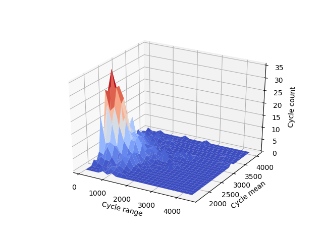
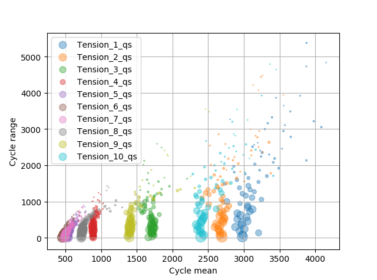

.. _examples:

Code examples
#############

.. note:: More examples will be provided on request.

Plot time series and power spectral density
*******************************************

Import the time series database, load data from file and plot all time series.

.. literalinclude:: examples/plot.py
   :language: python
   :linenos:
   :lines: 1-16
   :emphasize-lines: 16

You can also select a subset of the timeseries (suports wildcards) as shown below.

.. literalinclude:: examples/plot.py
   :language: python
   :linenos:
   :lineno-start: 15
   :lines: 18-19
   :emphasize-lines: 2

You can also plot the power spectral density of the selected time series. Because the 'surge' time series was sampled at
a varying time step the the time series are resampled to a constant time step of 0.1 seconds before the FFT.

.. literalinclude:: examples/plot.py
   :language: python
   :linenos:
   :lineno-start: 15
   :lines: 21-22
   :emphasize-lines: 2

Count cycles using the Rainflow algorithm
*****************************************

Fetch a single time series from the time series database, extract and visualize the cycle distribution using the
Rainflow algorithm.

.. literalinclude:: examples/rainflow.py
   :language: python
   :linenos:
   :lines: 1-27

    Single cycle range distribution.

    Single cycle range-mean distribution.

    Single 3D cycle range-mean distribution

Compare the cycle range and range-mean distribution from several time series using the methods on the TsDB class.

.. literalinclude:: examples/rainflow.py
   :language: python
   :linenos:
   :lineno-start: 30
   :lines: 30-34

    Comparison of several cycle range distributions.

    Comparison of several cycle range-mean distributions.

Apply low-pass and high-pass filters to time series
***************************************************

Initiate time series database and load time series file in one go. Plot the low-passed and high-passed time series and
the sum of those.

.. literalinclude:: examples/timeseries_filter.py
   :language: python
   :linenos:
   :lines: 1-

Merge files and export to different format
******************************************

.. todo:: Coming soon
