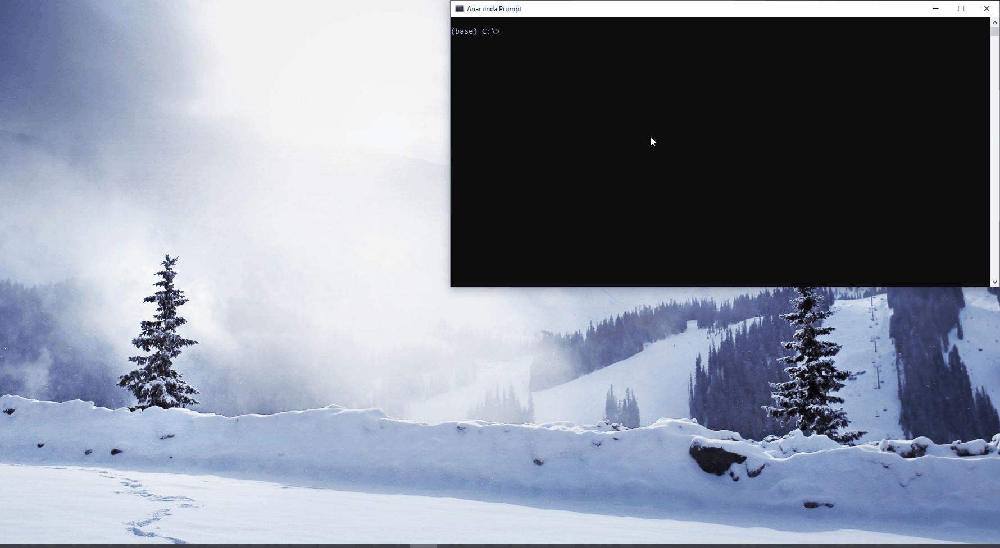
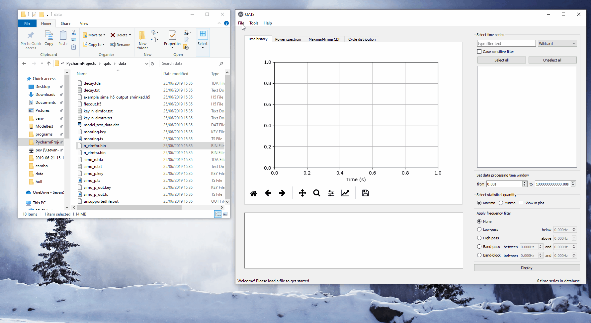

.. _gui:

Graphical User Interface
########################

.. todo:: Make more examples demonstrating typical operations.

Create link to GUI in start menu and desktop
********************************************

    In the terminal, run ``qats config --link-app`` to create start menu and desktop links to QATS. Pin the start menu
    link to the taskbar to further ease accessibility.

Import time series from file
****************************

    Here 41 time series from two files (different format) are imported. The first file is imported using the file open
    dialogue (hotkey *CTRL+I*) and the second by drag-and-drop. Finally the time series database is cleared (hotkey *Ctrl+Del*).

