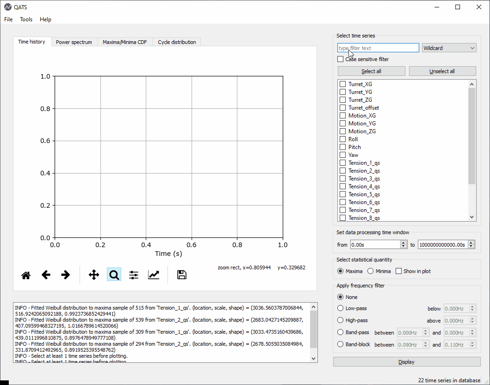

.. qats documentation master file, created by
   sphinx-quickstart on Sat Dec 16 19:53:09 2017.
   You can adapt this file completely to your liking, but it should at least
   contain the root `toctree` directive.

Welcome to QATS's documentation!
################################

General description
*******************

QATS is a python library and GUI for efficient inspection and analysis of time series. It simplifies and improves
post-processing, quality assurance and reporting of time-domain simulations.

Library
*******

The python library provides tools for:

* Import and export from/to various pre-defined time series file formats
* Signal processing
* Inferring statistical distributions
* Cycle counting using the Rainflow algorithm

It was originally created to handle time series files exported from `SIMO <https://www.dnvgl.com/services/complex-multibody-calculations-simo-2311/>`_
and `RIFLEX <https://www.dnvgl.com/services/riser-analysis-software-for-marine-riser-systems-riflex-2312>`_. Now it also
handles `SIMA <https://www.dnvgl.com/services/marine-operations-and-mooring-analysis-software-sima-2324>`_ hdf5 (.h5) files,
Matlab (version < 7.3) .mat files, CSV files and more. If you need handlers for other formats, create a feature
request (issue) or make it yourself and create a pull request.

See :ref:`examples` for more examples on how to invoke QATS in your own scripts to do more advance operations. :ref:`api`
provide information on the content of the QATS library.

GUI
***

QATS also features a :ref:`gui` which offers low threshold processing and vizualisation of time series. It is perfect for
inspecting, quality assurance and reporting. Use the library for more advanced operations.

Source code
***********

The `source code <https://github.com/dnvgl/qats>`_ and `issue tracker <https://github.com/dnvgl/qats/issues>`_ is on
GitHub.

Downloads
*********

You can download and install QATS from `PyPI <https://pypi.org/project/qats/>`_.

Table of contents
*****************
.. toctree::
   :maxdepth: 2

   getting_started
   examples
   gui
   api

Indices and tables
******************

* :ref:`genindex`
* :ref:`modindex`
* :ref:`search`
