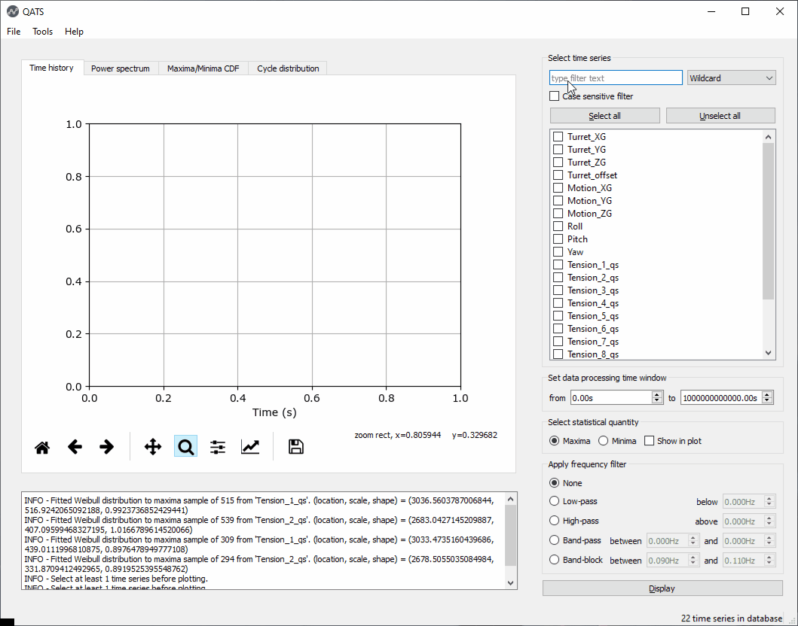

.. qats documentation master file, created by
   sphinx-quickstart on Sat Dec 16 19:53:09 2017.
   You can adapt this file completely to your liking, but it should at least
   contain the root `toctree` directive.

.. Welcome to QATS's documentation!
.. ################################

QATS documentation
##################

General description
*******************

QATS is a python library and GUI for efficient inspection and analysis of time series. It simplifies and improves
post-processing, quality assurance and reporting of time-domain simulations.

Library
*******

The python library provides tools for:

* Import and export from/to various pre-defined time series file formats
* Signal processing
* Inferring statistical distributions
* Cycle counting using the Rainflow algorithm

It was originally created to handle time series files exported from `SIMO <https://www.dnvgl.com/services/complex-multibody-calculations-simo-2311/>`_
and `RIFLEX <https://www.dnvgl.com/services/riser-analysis-software-for-marine-riser-systems-riflex-2312>`_. Now it also
handles `SIMA <https://www.dnvgl.com/services/marine-operations-and-mooring-analysis-software-sima-2324>`_ hdf5 (.h5) files,
Matlab (version < 7.3) .mat files, CSV files and more. If you need handlers for other formats, create a feature
request (issue) or make it yourself and create a pull request.

See :ref:`examples` for more examples on how to invoke QATS in your own scripts to do more advance operations. :ref:`api`
provide information on the content of the QATS library.

.. See :ref:`changelog` for changelog.

GUI
***

QATS also features a :ref:`gui` which offers low threshold processing and vizualisation of time series. It is perfect for
inspecting, quality assurance and reporting. Use the library for more advanced operations.

.. _python_version_support:

Python version support
**********************

QATS supports the Python versions that are officially supported, that is, versions with status **bugfix** or
**security** in the official `Status of Python versions <https://devguide.python.org/versions>`_.
QATS 5.4 supports Python 3.11, 3.12, 3.13 and 3.14.

The Python versions supported by the latest version of QATS are:

.. image:: https://img.shields.io/pypi/pyversions/qats
    :target: https://pypi.org/project/qats/

.. note::

   On Python 3.8, 3.9 or 3.10, stay on QATS 5.3. ``pip`` selects it automatically, since QATS 5.4 and later require
   Python 3.11 or later. The Python versions supported by a specific version of QATS are listed on
   `PyPI <https://pypi.org/project/qats/>`_.

Source code, Issue tracker and Changelog
****************************************

The `source code <https://github.com/dnvgl/qats>`_, `issue tracker <https://github.com/dnvgl/qats/issues>`_ and
`changelog <https://github.com/dnvgl/qats/releases>`_ are hosted on GitHub.

Downloads
*********

.. You can download and install QATS from `PyPI <https://pypi.org/project/qats/>`_. 
.. Or, see the :ref:`getting_started` for installation instructions.

QATS may be downloaded from `PyPI/qats <https://pypi.org/project/qats/>`_. 
See the :ref:`getting_started` section for installation instructions.

Table of contents
*****************
.. toctree::
   :maxdepth: 2

   getting_started
   examples
   gui
   api/index
   changes

.. Indices and tables
.. ******************
..
.. * :ref:`genindex`
.. * :ref:`modindex`
.. * :ref:`search`

..
.. Add project links in sidebar
..

.. toctree::
   :hidden:
   :maxdepth: 1
   :caption: Project links

   PyPI Project <https://pypi.org/project/qats/>
   GitHub Repository <https://github.com/dnvgl/qats>
   Issue Tracker <https://github.com/dnvgl/qats/issues>
   Changelog <https://github.com/dnvgl/qats/releases>
